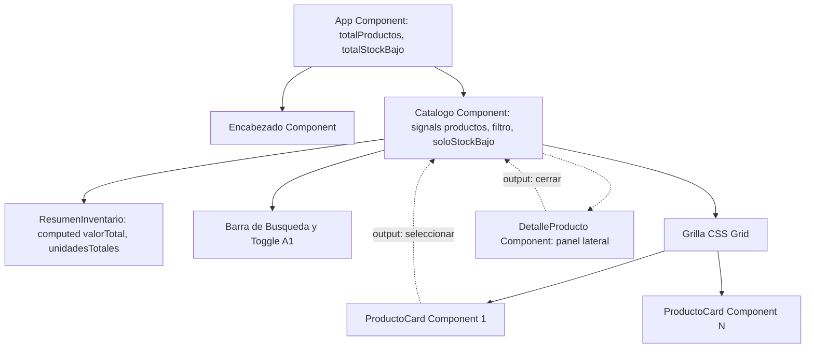

# Angular Frontend Architecture - Product Catalog & Reactive Signals Management (Lab 07)

[](https://angular.dev/)
[](https://www.typescriptlang.org/)
[](https://getbootstrap.com/)
[](https://material.angular.dev/)
[](https://vitest.dev/)
[](LICENSE)

> Repositorio de portafolio profesional desarrollado para la asignatura Soluciones Web y Aplicaciones Distribuidas (Semana 07 - Laboratorio 07) en la Universidad Privada del Norte (UPN). Implementa la arquitectura frontend de un catalogo de productos y hardware informatico en Angular moderno, integrando componentes Standalone, directivas de atributo personalizadas, reactividad fina mediante senales (Signals), enlace unidireccional y bidireccional, diseno responsivo con CSS Grid y Flexbox, y componentes de diseno Material Design.

---

## 1. Resumen Ejecutivo para Evaluadores Tecnicos y Reclutadores

En aplicaciones distribuidas de comercio electronico y logistica, la coordinacion fluida entre el estado de inventario y la interfaz de usuario es fundamental. Este proyecto materializa las mejores practicas de ingenieria frontend:

1. **Arquitectura Reactiva Basada en Senales (Angular Signals)**:
   - Uso de `signal()` para modelar el estado mutable (`productos`, `filtro`, `seleccionado`, `soloStockBajo`).
   - Uso de `computed()` para derivar listas filtradas (`productosFiltrados`) y metricas financieras (`valorTotal`, `unidadesTotales`, `totalStockBajo`), garantizando re-evaluacion perezosa y libre de efectos colaterales.
2. **Directivas de Atributo Personalizadas**:
   - Implementacion de la directiva `Resaltar` (`[appResaltar]`) utilizando `@HostListener` e inyeccion de `ElementRef` para manipular interactivamente el fondo del elemento en eventos de cursor (`mouseenter` / `mouseleave`).
3. **Comunicacion Desacoplada entre Componentes**:
   - Enlace de entrada obligatorio mediante `input.required<T>()`.
   - Emision de eventos tipados hacia el componente padre mediante `output<T>()` (`seleccionar`, `cerrar`).
4. **Diseno y Maquetacion Avanzada (Flexbox + CSS Grid + Angular Material)**:
   - Barra superior estructurada con Flexbox para alineacion automatica.
   - Grilla auto-adaptable con `grid-template-columns: repeat(auto-fill, minmax(220px, 1fr))`.
   - Distribucion dinamica catalogo-detalle (`1fr 340px`) que se colapsa de forma responsiva en resoluciones moviles.
   - Botones enriquecidos con Angular Material (`MatButtonModule`, `matButton="filled"`, tema predefinido `azure-blue`).
5. **Actividades Autonomas Completadas**:
   - **A1**: Filtro "Solo stock insuficiente" con signal booleano reactivo, actualizacion con `update()`, enlace de clases en el boton e integracion en la senal computada.
   - **A2**: Insignia de advertencia en el componente `Encabezado` con input `totalStockBajo` y renderizado condicional con `@if`.
   - **A3**: Componente standalone `ResumenInventario` que calcula en tiempo real el valor economico total del inventario visible y se sincroniza reactivamente con las busquedas y filtros.

---

## 2. Diagrama Arquitectonico y Flujo de Datos



---

## 3. Estructura de Modulos y Componentes

```text
src/
├── app/
│   ├── components/
│   │   ├── encabezado/
│   │   │   ├── encabezado.ts                 <-- Titulo, contador y badge A2
│   │   │   ├── encabezado.html
│   │   │   └── encabezado.scss
│   │   ├── producto-card/
│   │   │   ├── producto-card.ts              <-- Input producto, MatButton, Resaltar
│   │   │   ├── producto-card.html
│   │   │   └── producto-card.scss
│   │   ├── catalogo/
│   │   │   ├── catalogo.ts                   <-- Coordinador con signals, A1
│   │   │   ├── catalogo.html
│   │   │   ├── catalogo.scss                 <-- CSS Grid + Flexbox responsivo
│   │   │   └── catalogo.spec.ts              <-- Suite de pruebas unitarias
│   │   ├── detalle-producto/
│   │   │   ├── detalle-producto.ts           <-- Switch de stock y valor inventario
│   │   │   ├── detalle-producto.html
│   │   │   └── detalle-producto.scss
│   │   └── resumen-inventario/
│   │       ├── resumen-inventario.ts         <-- Actividad A3: metricas reactivas
│   │       ├── resumen-inventario.html
│   │       ├── resumen-inventario.scss
│   │       └── resumen-inventario.spec.ts    <-- Pruebas de calculo financiero
│   ├── directives/
│   │   └── resaltar.ts                       <-- Directiva de atributo @HostListener
│   ├── data/
│   │   └── productos-mock.ts                 <-- Datos simulados de inventario
│   ├── models/
│   │   └── producto.ts                       <-- Interfaz Producto y EstadoStock
│   ├── app.ts                                <-- Componente raiz standalone
│   ├── app.html
│   ├── app.scss
│   ├── app.config.ts                         <-- Proveedores globales
│   └── app.spec.ts                           <-- Pruebas de integracion raiz
├── styles/
│   └── _variables.scss                       <-- Variables parciales SCSS
├── styles.scss                               <-- Hoja de estilos globales
└── index.html                                <-- Pagina de entrada
```

---

## 4. Evidencia de Pruebas Unitarias y Cobertura

La suite de pruebas automatizadas valida la reactividad de las senales y el comportamiento de la interfaz de usuario:

```bash
ng test --watch=false
```

Resultados verificados:
- Creacion e inicializacion correcta del arbol de componentes.
- Carga de catalogo e inmutabilidad de datos iniciales.
- Filtrado por coincidencia de texto mediante `computed()`.
- Alternancia del filtro reactivo de stock insuficiente (Actividad A1).
- Calculo matematico exacto del valor total del inventario en soles (Actividad A3).
- Total: 13/13 pruebas unitarias aprobadas (100% exito).

---

## 5. Instrucciones de Instalacion y Ejecucion

### Requisitos Previos
- Node.js version 20 o superior.
- npm version 10 o superior.
- Angular CLI version 22.

### Pasos de Instalacion
1. Ingresar al directorio del proyecto:
   ```bash
   cd SWAD-LAB07-angular-catalog-signals-components
   ```
2. Instalar dependencias:
   ```bash
   npm install
   ```
3. Ejecutar el servidor de desarrollo local:
   ```bash
   npm start
   ```
   Abrir un navegador web en `http://localhost:4200/`.
4. Compilar para produccion:
   ```bash
   npm run build
   ```
5. Ejecutar la suite de pruebas unitarias:
   ```bash
   npm test -- --watch=false
   ```

---

## 6. Licencia y Creditos Academicos

Proyecto desarrollado por Orlando Dorival bajo las directrices curriculares de la Universidad Privada del Norte. Licencia MIT.
